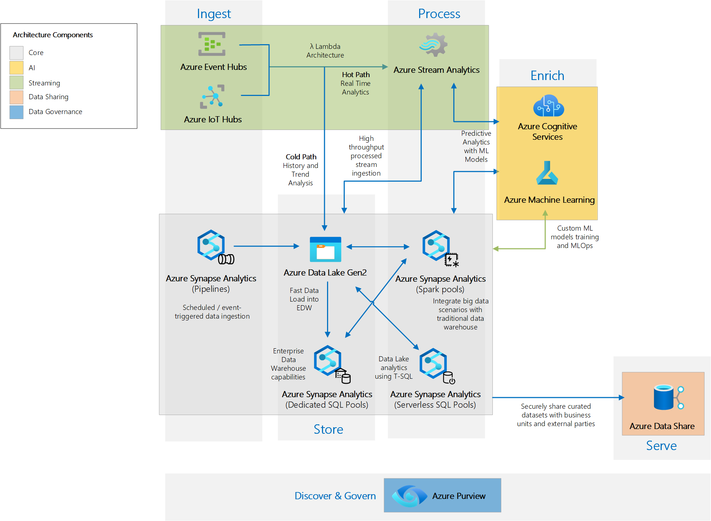

# Azure Analytics End to End with Azure Synapse - Deployment Accelerator

## Overview

This is a deployment accelerator based on the reference architecture described in the Azure Architecture Centre article [Analytics end-to-end with Azure Synapse](https://docs.microsoft.com/en-us/azure/architecture/example-scenario/dataplate2e/data-platform-end-to-end). 

It's implemented through the use of [Azure Bicep](https://github.com/Azure/bicep) declarative infrastructure as code. The aim is to accelerate the successful deployment and automate the configuration steps required to integrate the Azure Data Services that make up a valuable end-to-end analytics platform tailored for business use needs.

## Deploy

Before you hit the deploy button, make sure you review the details about the services deployed.

## Azure Services Provisioned

The Azure services in the architecture above have been divided into components that can be conditionally deployed based on the deployment parameters to better suit the needs of the workload.

The following services are part of the architecture and will be deployed as part of the accelerator. All services will be deployed in a single resource group and in the region where the resource group was defined.

> **Note:** Services names will be appended with a unique 5-letter *suffix* to ensure name uniqueness in Azure.

Component        |Name                           | Type                      | Pricing Tier             |Pricing Info   | Conditional  |Notes
-----------------|-------------------------------|---------------------------|--------------------------|---------------|--------------|------------
Core             |az-*resource group name*-uami  |Managed Identity           | N/A                      |               |              | Required to run post-deployment scripts. Should be deleted once deployment is complete.
Core             |azsynapsewks*suffix*           |Synapse workspace          | N/A                      |               | No           |
Core             |SparkCluster                   |Apache Spark pool          | Small (3 nodes)          |               | No           |
Core             |EnterpriseDW                   |Synapse SQL pool           | DW100                    |               | Yes          |
Core             |azdatalake*suffix*             |Storage account            | N/A                      |               | No           |
Core             |azkeyvault*suffix*             |Key vault                  | N/A                      |               | No           |
Core             |SynapsePostDeploymentScript    |Deployment Script          | N/A                      |               | No           |Deployment script resources will be automatically deleted after 24hs.
Data Governance  |azpurview*suffix*              |Purview account            | N/A                      |               | Yes          |
Data Governance  |PurviewPostDeploymentScript    |Deployment Script          | N/A                      |               | Yes          | Deployment script resources will be automatically deleted after 24hs.
AI               |azanomalydetector*suffix*      |Anomaly detector           | N/A                      |               | Yes          |
AI               |azcognitives*suffix*           |Cognitive Services account | N/A                      |               | Yes          |
AI               |azmlwks*suffix*                |Machine learning workspace | N/A                      |               | Yes          |
AI               |azmlstorage*suffix*            |Storage account            | N/A                      |               | Yes          |
AI               |azmlcontainerreg*suffix*       |Container registry         | N/A                      |               | Yes          |
AI               |azmlappinsights*suffix*        |Application Insights       | N/A                      |               | Yes          |
Data Share       |azdatashare*suffix*            |Data Share                 | N/A                      |               | Yes          |
Streaming        |azeventhubns*suffix*           |Event Hub namespace        | Standard                 |               | Yes          |
Streaming        |azstreamjob*suffix*            |Stream Analytics job       | Standard                 |               | Yes          |

## Contributing
If you would like to contribute to the solution (log bugs, issues, or add code) we have details on how to do that in our [CONTRIBUTING.md](https://github.com/fabragaMS/AzureAnalyticsE2E/blob/master/README.md) file.

## License
Details on licensing for the project can be found in the [LICENSE](https://github.com/fabragaMS/AzureAnalyticsE2E/blob/master/LICENSE) file.